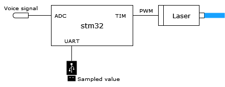
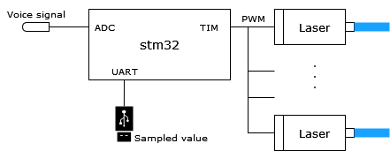

# Laser-based Audio Injection Attack

This projct implements an audio injection attack method based on laser.

The inspiration mainly comes from Sugawara et al.'s work [[1]](#1)

## Introduction

Most voice-controllable devices (e.g. Google Home) feature with MEMS microphone, which is vulnerable to laser command.

It means that we can modulate a laser beam with voice signal using AM modulation, and inject commands into MEMS microphone.

## Implementation

I implement it with stm32f4, PWM-controllable laser engraving module. As it is shown in the image below, stm32 samples voice signal from ADC, and control PWN output according to the sampled value. The UART serial port is designed to output the sampled value so that I can monitor it and make sure it is working properly.

Specifically, the laser engraving module must be PWM-controllable, in order to AM modulate the laser beam.

[C#-Serial](C%23-Serial/) is a serial monitor implemented with C# (.net5.0), to monitor the sampled value taken by stm32.

## Result

Google Home is a voice-controllable device with 2 MEMS microphones. A single laser beam is possible to attack successfully, while 2 laser beams will significantly improve the success rate.

The more MEMS microphones a device has, the more laser beams are required to perform the attack, which is shown below.

## References
<a id="1">[1]</a> 
Sugawara, Takeshi, et al.
"Light Commands:Laser-Based Audio Injection Attacks on Voice-Controllable Systems."
29th USENIX Security Symposium (USENIX Security 20). 2020.